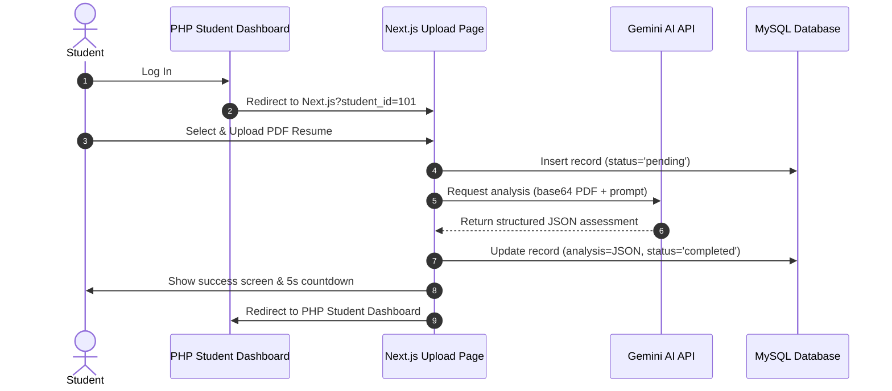

# EximAssist Resume Analysis

An AI-powered resume upload, parsing, and assessment application that integrates seamlessly with an existing student examination platform.

---

## 1. Project Overview

*   **Project Name:** EximAssist Resume Analysis
*   **Purpose:** Provides students with a user-friendly drag-and-drop interface to upload their PDF resume, analyzes it using generative AI, and persists structured analysis reports to a shared MySQL database for mentor evaluation.
*   **Tech Stack:** Next.js 16.2.6 (Turbopack, App Router), MySQL (GoDaddy cPanel), Cloudinary (PDF upload storage), Gemini API (Resume assessment)
*   **Deployed URL:** [https://eximassist-resume-analysis.vercel.app](https://eximassist-resume-analysis.vercel.app)

---

## 2. Folder Structure

The application code resides inside the `src/` directory. Unused admin pages, auth modules, and mongoose templates have been fully pruned:

```
src/
├── app/
│   ├── _components/
│   │   ├── DropZone.tsx          # Client-side file drop area with drag-over state management
│   │   ├── Icons.tsx             # Curated SVG icons for UI micro-interactions
│   │   └── UploadForm.tsx        # File validation, submission handler, and countdown/redirect interface
│   ├── api/
│   │   ├── analyze/
│   │   │   └── route.ts          # Endpoint handling Cloudinary uploading, Gemini parsing, and DB updates
│   │   └── migrate/
│   │       └── route.ts          # Authenticated database schema migration endpoint
│   ├── thank-you/
│   │   └── page.tsx              # Static success confirmation screen
│   ├── favicon.ico               # Favicon asset
│   ├── globals.css               # Theme styling variables, custom fonts, and root styles
│   ├── layout.tsx                # Base HTML root layout wrapper
│   └── page.tsx                  # Home page extracting student query parameters and hosting the UploadForm
├── lib/
│   ├── analyze-helpers.ts        # Helper methods for Cloudinary buffer streaming and retry-guarded Gemini API calls
│   ├── cloudinary.ts             # Cloudinary SDK client configuration
│   ├── db.ts                     # Database connection pool manager using mysql2/promise
│   ├── migrate.ts                # Migration script containing DDL statement for the resume_submissions table
│   └── submissions.ts            # Database access methods to query/modify student and submission tables
└── types/
    └── analysis.ts               # Core TypeScript type definitions and interfaces for analysis schemas
```

---

## 3. Environment Variables

Create a `.env.local` file at the root of the project. The following variables are required:

```env
# Database
DB_HOST=                  # GoDaddy MySQL remote hostname or IP address (Required)
DB_PORT=                  # MySQL connection port (typically 3306) (Required)
DB_NAME=                  # MySQL database name (Required)
DB_USER=                  # MySQL username (Required)
DB_PASS=                  # MySQL user password (Required)

# Cloudinary
CLOUDINARY_CLOUD_NAME=    # Cloudinary cloud namespace name (Required)
CLOUDINARY_API_KEY=       # Cloudinary account API key credentials (Required)
CLOUDINARY_API_SECRET=    # Cloudinary account API secret credentials (Required)

# AI
GEMINI_API_KEY=           # Google Gemini API key used for content generation (Required)

# Migration (remove after use)
MIGRATE_KEY=              # Authorization token header to trigger /api/migrate (Required)
```

---

## 4. Database Setup

*   **Hosting:** Hosted on GoDaddy cPanel MySQL under `examination_db`.
*   **Tables:** Integrates with the existing `students` table, and introduces the `resume_submissions` table.
*   **Foreign Key Constraint:** `resume_submissions.student_id` is linked to `students.id` with `ON DELETE CASCADE`.

### Schema of `resume_submissions` Table

```sql
CREATE TABLE IF NOT EXISTS resume_submissions (
  id INT(11) NOT NULL AUTO_INCREMENT,
  student_id INT(11) NOT NULL,
  resume_url VARCHAR(500) NOT NULL,
  resume_public_id VARCHAR(300) NOT NULL,
  uploaded_at TIMESTAMP NOT NULL DEFAULT CURRENT_TIMESTAMP,
  status ENUM('pending','completed','failed') DEFAULT 'pending',
  analysis LONGTEXT DEFAULT NULL,
  PRIMARY KEY (id),
  KEY student_id (student_id),
  CONSTRAINT resume_submissions_ibfk_1 
    FOREIGN KEY (student_id) REFERENCES students(id) ON DELETE CASCADE
) ENGINE=InnoDB DEFAULT CHARSET=latin1 COLLATE=latin1_swedish_ci;
```

### Running the Database Migration
Trigger the table creation securely by sending a `GET` request to the migration endpoint:
*   **Endpoint:** `/api/migrate`
*   **Required Header:** `x-migrate-key: <your_MIGRATE_KEY>`

---

## 5. API Routes

### `POST /api/analyze`
*   **Purpose:** Core submission handler to upload the file, request AI evaluation, and update the database.
*   **Content-Type:** `multipart/form-data`
*   **Payload (FormData):**
    *   `student_id`: Numerical student ID (String / Number)
    *   `resume`: PDF File (Max 5MB)
*   **Operation Flow:**
    1. Validate presence of `student_id` and `resume`.
    2. Enforce PDF file type and max 5MB size limit.
    3. Upload file buffer stream to Cloudinary folder `eximassist/resumes`.
    4. Create database record in `resume_submissions` with status `pending`.
    5. Convert PDF buffer to base64, then submit to the Gemini API (`gemini-2.5-flash` primary, fallback `gemini-1.5-flash` on rate-limit) with our structured prompt layout.
    6. Update database record with parsed JSON results and set status to `completed`.
    7. On failure, update database record status to `failed` and return an error.
*   **Success Response (201 Created):**
    ```json
    {
      "success": true,
      "submissionId": 142
    }
    ```
*   **Error Responses:**
    *   `400 Bad Request`: `{ "error": "Both student_id and resume are required." }`
    *   `500 Internal Server Error`: `{ "error": "Description of underlying failure." }`

### `GET /api/migrate`
*   **Purpose:** Initial deployment schema builder.
*   **Headers:** `x-migrate-key` (Must match environment variable `MIGRATE_KEY`).
*   **Success Response (200 OK):**
    ```json
    {
      "success": true,
      "message": "Migration completed successfully"
    }
    ```

---

## 6. User Flow



---

## 7. Integration with PHP App

### Fetching Analysis Data (MySQL)
The administrative dashboard on the PHP side can fetch student submissions and AI results via:

```sql
SELECT 
    st.id AS student_id,
    st.name AS student_name,
    st.email AS student_email,
    rs.resume_url,
    rs.status AS upload_status,
    rs.analysis AS ai_analysis_json
FROM students st
LEFT JOIN resume_submissions rs ON st.id = rs.student_id
ORDER BY rs.uploaded_at DESC;
```

### Analysis JSON Schema
The `analysis` column in `resume_submissions` stores a JSON string adhering to the following structure:

```json
{
  "summary": "2-3 sentence honest overall assessment",
  "domains": [
    {
      "name": "Domain name (e.g. Frontend Development)",
      "confidence": "High",
      "evidencePoints": [
        "React Projects",
        "Tailwind CSS experience"
      ],
      "gapPoints": [
        "Next.js concepts",
        "System Architecture"
      ]
    }
  ],
  "qualities": [
    {
      "title": "Strong Quality Title",
      "description": "One sentence referencing specific content from the resume."
    }
  ]
}
```

---

## 8. Local Development Setup

1.  **Clone the Repository:**
    ```bash
    git clone <repository_url>
    cd resume-analysis-tezsid
    ```
2.  **Install Project Dependencies:**
    ```bash
    pnpm install
    ```
3.  **Setup Environment Variables:**
    Duplicate the `.env.local` variables listed in Section 3 and populate them with active connection strings.
4.  **Whitelist Client IP:**
    Log in to cPanel on GoDaddy, navigate to **Remote MySQL**, and add your current public IP address to allow database connection access.
5.  **Start Development Server:**
    ```bash
    pnpm dev
    ```
6.  **Execute Table Migration:**
    Send a `GET` request using Postman, Curl, or your browser:
    *   URL: `http://localhost:3000/api/migrate`
    *   Header: `x-migrate-key: <your_MIGRATE_KEY>`
7.  **Test Upload Interface:**
    Navigate to `http://localhost:3000?student_id=1` and upload a test PDF resume.

---

## 9. Deployment

The application is deployed on **Vercel**:

*   **Vercel Settings:** Add all keys from `.env.local` to Vercel Environment Variables in the project dashboard.
*   **GoDaddy Remote MySQL Configuration:** Since Vercel uses dynamic outbound IP addresses, you must whitelist all connections by adding `%` or `0.0.0.0/0` under GoDaddy's Remote MySQL configuration.
*   **Production Checks:** Ensure `pnpm build` compiles successfully locally before deploying.

---

## 10. Known Issues / Notes

*   **Gemini API Rate Limiting (503):** Under heavy load, the Gemini API may throw a 503 error. The API handler catches this exception, updates the database submission row to `failed`, and prompts the user to re-attempt the upload.
*   **cPanel Connection Security:** If database connection timeouts occur, verify that remote access to GoDaddy MySQL is correctly whitelisted for the querying IP or environment.
*   **Password Hashing:** Passwords in the `students` table are stored as SHA256 hashes generated by the client application.
*   **Migration Route Security:** Keep `MIGRATE_KEY` secure. Once the database schema is confirmed to be set up, the `/api/migrate` route directory `src/app/api/migrate` can be deleted safely from production.
